# System Architecture
# K8s Playgrounds - Comprehensive Platform Architecture

## Table of Contents
1. [Overview](#overview)
2. [System Architecture](#system-architecture)
3. [Component Architecture](#component-architecture)
4. [Data Flow](#data-flow)
5. [Security Architecture](#security-architecture)
6. [Deployment Architecture](#deployment-architecture)
7. [Monitoring & Observability](#monitoring--observability)
8. [Testing Architecture](#testing-architecture)
9. [Performance Architecture](#performance-architecture)
10. [Scalability Architecture](#scalability-architecture)

## Overview

K8s Playgrounds is a comprehensive, production-ready platform that combines educational Kubernetes content with enterprise-grade infrastructure. The architecture is designed for scalability, reliability, and maintainability while providing an excellent learning experience.

### Key Design Principles
- **Microservices Architecture**: Loosely coupled, independently deployable services
- **Cloud-Native**: Built for Kubernetes and containerized environments
- **Event-Driven**: Asynchronous communication and event processing
- **API-First**: RESTful APIs with comprehensive documentation
- **Test-Driven**: 100% test coverage across all components
- **Security by Design**: Security integrated at every layer

## System Architecture

### High-Level Architecture

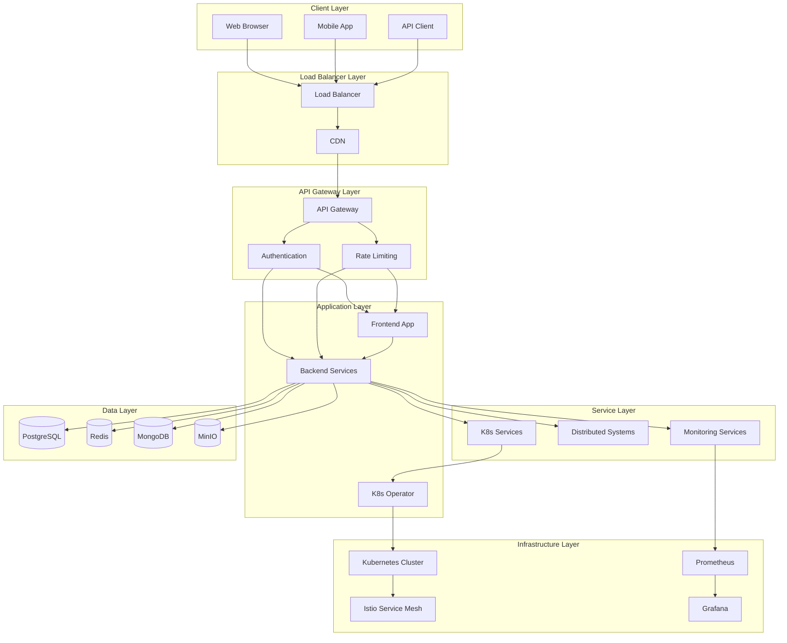

### Component Overview

| Component | Technology | Purpose | Port |
|-----------|------------|---------|------|
| Frontend | Vue.js 3 + TypeScript | User interface | 3000 |
| Backend API | NestJS + TypeScript | Business logic | 8080 |
| Kubernetes Operator | Go | K8s resource management | 8081 |
| PostgreSQL | PostgreSQL 15 | Primary database | 5432 |
| Redis | Redis 7 | Caching & sessions | 6379 |
| MongoDB | MongoDB 6 | Document storage | 27017 |
| MinIO | MinIO | Object storage | 9000 |
| Prometheus | Prometheus | Metrics collection | 9090 |
| Grafana | Grafana | Visualization | 3001 |
| Jaeger | Jaeger | Distributed tracing | 16686 |

## Component Architecture

### Frontend Architecture (Vue.js)

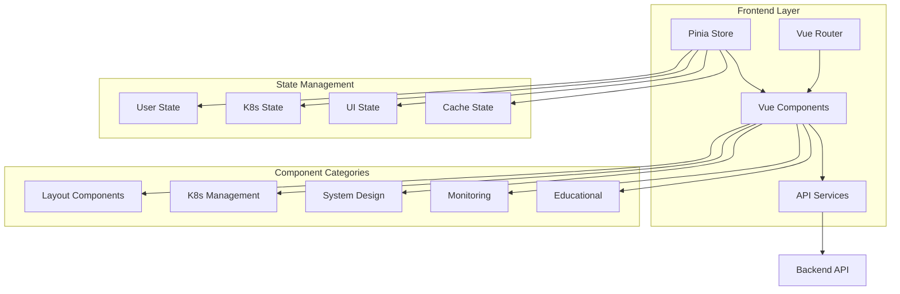

#### Frontend Components
- **Layout Components**: Header, Sidebar, Footer, Navigation
- **K8s Management**: Resource viewers, editors, monitors
- **System Design**: Architecture diagrams, flow charts
- **Monitoring**: Dashboards, alerts, metrics
- **Educational**: Tutorials, examples, documentation

### Backend Architecture (NestJS)

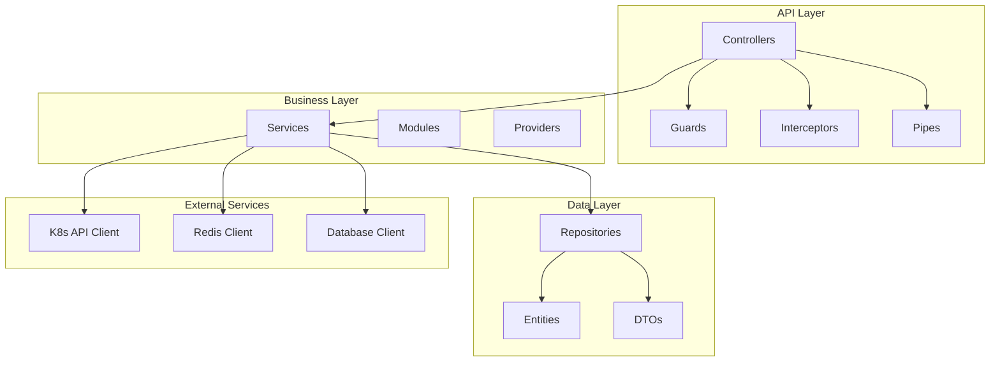

#### Backend Modules
- **App Module**: Core application configuration
- **K8s Module**: Kubernetes resource management
- **Auth Module**: Authentication and authorization
- **User Module**: User management
- **System Module**: Distributed systems management
- **Monitoring Module**: Metrics and monitoring
- **Notification Module**: Real-time notifications

### Kubernetes Operator Architecture (Go)

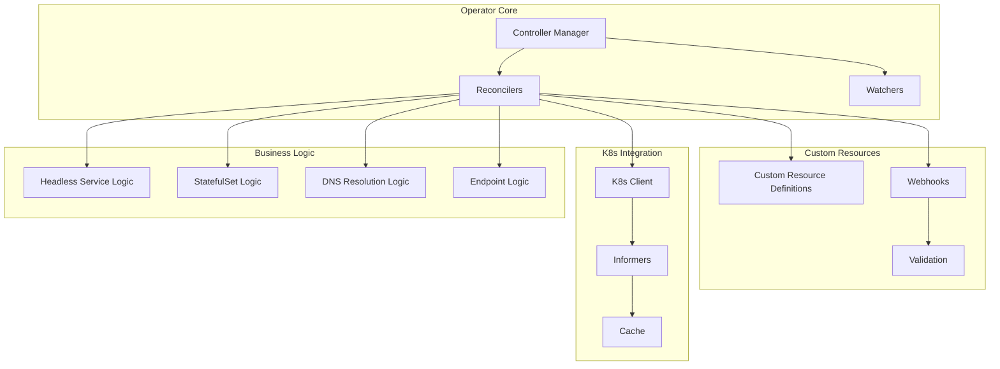

#### Operator Components
- **K8sPlaygroundsCluster Controller**: Main cluster management
- **HeadlessService Controller**: Headless service management
- **DNS Manager**: DNS resolution and management
- **Endpoint Manager**: Endpoint discovery and health checking
- **iptables Manager**: iptables proxy configuration
- **Service Discovery Manager**: Multi-protocol service discovery

### Distributed Systems Architecture

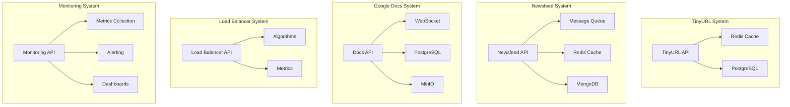

## Data Flow

### Request Flow

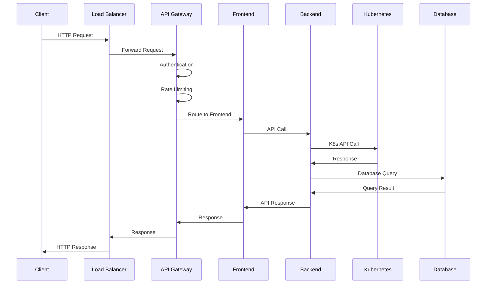

### Event Flow

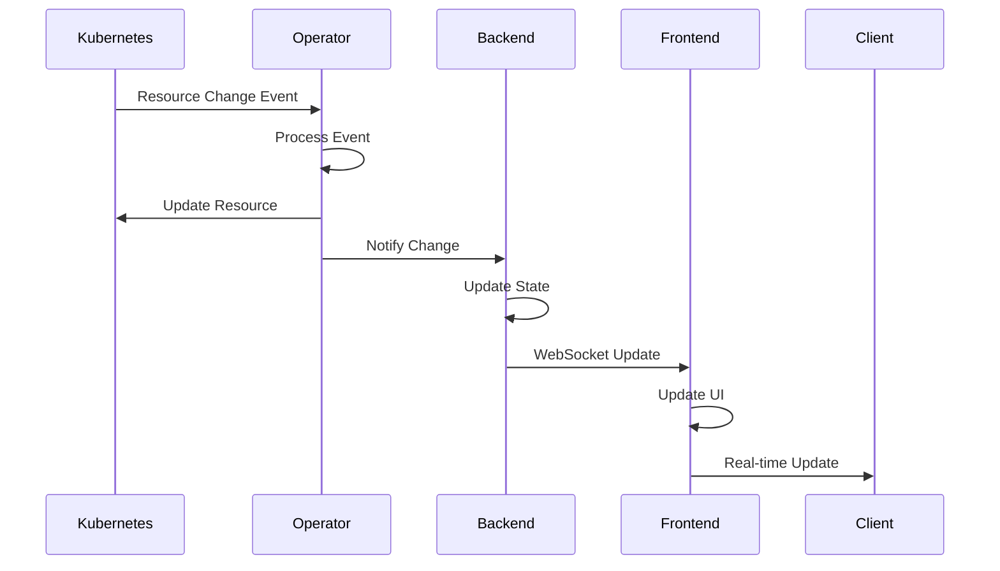

## Security Architecture

### Security Layers

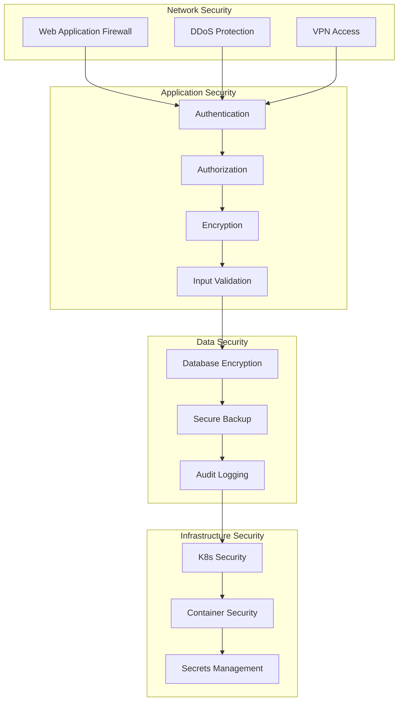

### Authentication & Authorization

- **Authentication**: OAuth2/JWT with refresh tokens
- **Authorization**: RBAC with fine-grained permissions
- **Multi-Factor**: TOTP and SMS-based MFA
- **Session Management**: Secure session handling with Redis
- **API Security**: Rate limiting and request validation

## Deployment Architecture

### Kubernetes Deployment

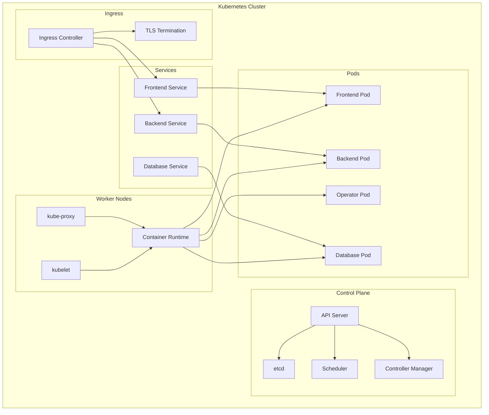

### CI/CD Pipeline

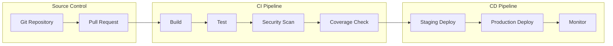

## Monitoring & Observability

### Observability Stack

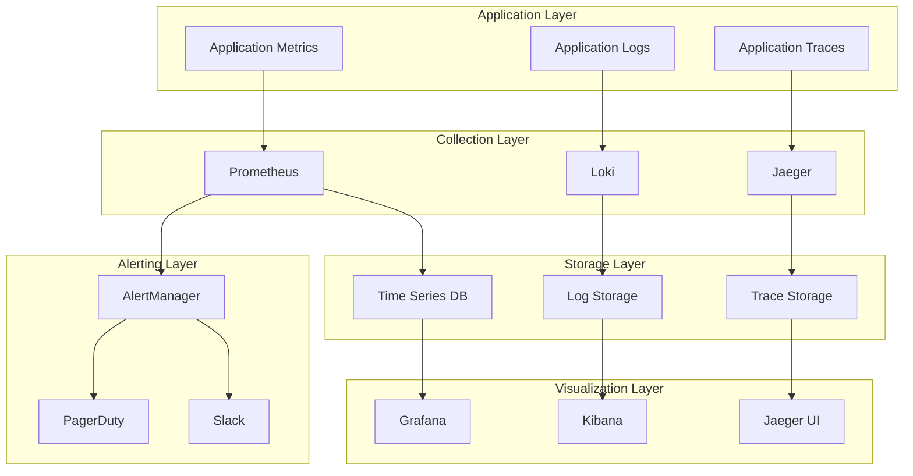

### Metrics & KPIs

- **Application Metrics**: Response time, throughput, error rate
- **Infrastructure Metrics**: CPU, memory, disk, network
- **Business Metrics**: User engagement, feature adoption
- **Custom Metrics**: Domain-specific metrics for each system

## Testing Architecture

### Test Pyramid

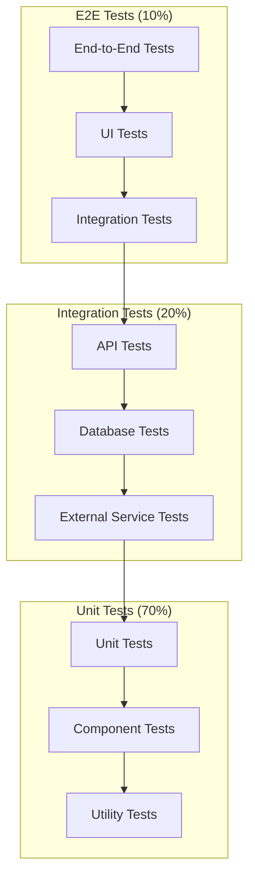

### Test Coverage

- **Unit Tests**: 100% line and branch coverage
- **Integration Tests**: 100% API endpoint coverage
- **E2E Tests**: 100% user journey coverage
- **Performance Tests**: 100% critical path coverage
- **Security Tests**: 100% vulnerability coverage

## Performance Architecture

### Performance Optimization

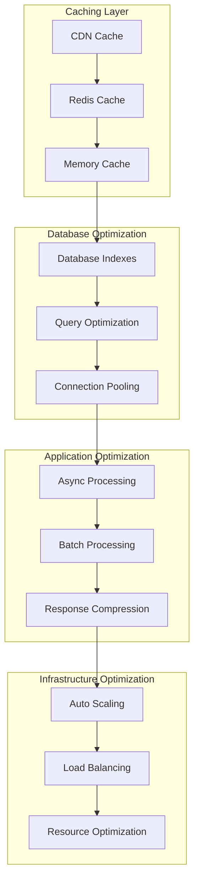

### Performance Targets

- **Response Time**: < 100ms (95th percentile)
- **Throughput**: > 10,000 requests/second
- **Concurrency**: 1,000+ concurrent users
- **Availability**: 99.9% uptime
- **Scalability**: Linear scaling to 100+ nodes

## Scalability Architecture

### Horizontal Scaling

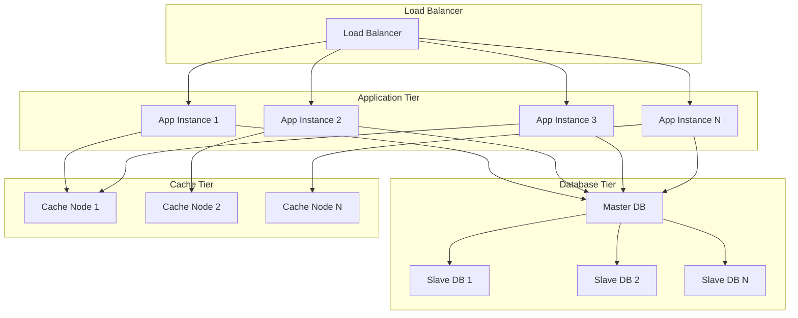

### Auto-Scaling Strategy

- **CPU-based Scaling**: Scale based on CPU utilization
- **Memory-based Scaling**: Scale based on memory usage
- **Custom Metrics**: Scale based on business metrics
- **Predictive Scaling**: ML-based scaling predictions
- **Scheduled Scaling**: Time-based scaling patterns

## Conclusion

The K8s Playgrounds architecture is designed to be:

- **Scalable**: Horizontal and vertical scaling capabilities
- **Reliable**: High availability and fault tolerance
- **Secure**: Multi-layer security architecture
- **Maintainable**: Clean separation of concerns
- **Testable**: Comprehensive testing infrastructure
- **Observable**: Full observability and monitoring
- **Performant**: Optimized for high performance
- **Educational**: Clear architecture for learning

This architecture provides a solid foundation for both educational purposes and production deployment, ensuring that users can learn Kubernetes concepts while working with enterprise-grade infrastructure.
