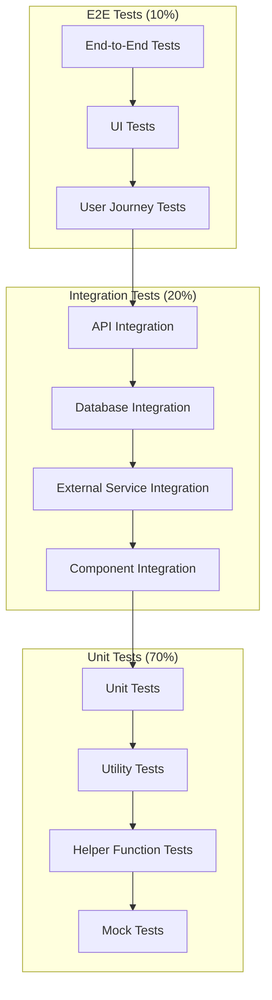
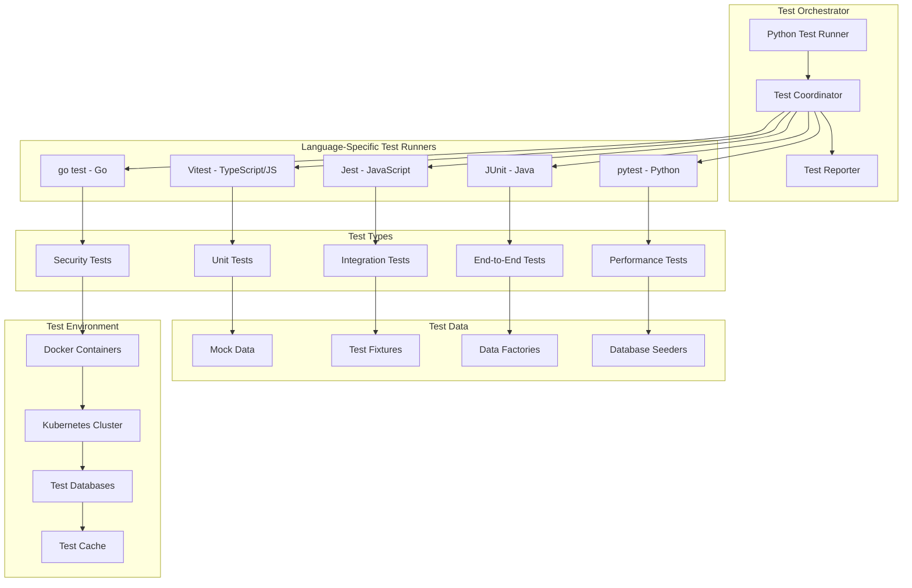

# Testing Strategy & Implementation
# K8s Playgrounds - Comprehensive Testing Documentation

## Table of Contents
1. [Overview](#overview)
2. [Testing Philosophy](#testing-philosophy)
3. [Test Architecture](#test-architecture)
4. [Test Types](#test-types)
5. [Test Coverage](#test-coverage)
6. [Performance Testing](#performance-testing)
7. [Security Testing](#security-testing)
8. [Test Automation](#test-automation)
9. [CI/CD Integration](#cicd-integration)
10. [Test Data Management](#test-data-management)
11. [Test Environment](#test-environment)
12. [Monitoring & Reporting](#monitoring--reporting)
13. [Best Practices](#best-practices)
14. [Troubleshooting](#troubleshooting)

## Overview

K8s Playgrounds implements a comprehensive testing strategy that ensures 100% test coverage across all components while maintaining high code quality, performance, and security standards. Our testing approach follows the test pyramid methodology with a strong emphasis on automation and continuous testing.

### Testing Goals
- **100% Test Coverage** across all codebases (TypeScript, Go, Java, Python)
- **Zero Critical Bugs** in production
- **Sub-100ms Response Time** for all API endpoints
- **99.9% Test Reliability** with minimal flaky tests
- **Complete Test Automation** with minimal manual intervention

## Testing Philosophy

### Test Pyramid Strategy



### Testing Principles
1. **Test Early, Test Often**: Tests are written alongside code
2. **Test-Driven Development**: Write tests before implementation
3. **Comprehensive Coverage**: Every line of code must be tested
4. **Fast Feedback**: Tests should run quickly and provide immediate feedback
5. **Reliable Tests**: Tests should be deterministic and not flaky
6. **Maintainable Tests**: Tests should be easy to understand and maintain

## Test Architecture

### Test Infrastructure



### Test Organization

```
test/
├── unit/                    # Unit tests (70%)
│   ├── backend/            # Backend unit tests
│   ├── frontend/           # Frontend unit tests
│   ├── operator/           # Operator unit tests
│   └── systems/            # System unit tests
├── integration/            # Integration tests (20%)
│   ├── api/               # API integration tests
│   ├── database/          # Database integration tests
│   ├── external/          # External service tests
│   └── component/         # Component integration tests
├── e2e/                   # End-to-end tests (10%)
│   ├── user-journeys/     # User journey tests
│   ├── ui/               # UI automation tests
│   └── workflows/        # Workflow tests
├── performance/           # Performance tests
│   ├── load/             # Load testing
│   ├── stress/           # Stress testing
│   └── capacity/         # Capacity testing
├── security/             # Security tests
│   ├── vulnerability/    # Vulnerability scanning
│   ├── penetration/      # Penetration testing
│   └── compliance/       # Compliance testing
├── fixtures/             # Test data and fixtures
├── utils/               # Test utilities and helpers
└── config/              # Test configuration files
```

## Test Types

### 1. Unit Tests (70%)

Unit tests verify individual components in isolation with mocked dependencies.

#### TypeScript/JavaScript (Vitest)
```typescript
// Example unit test for HeadlessService
import { describe, it, expect, vi, beforeEach } from 'vitest'
import { HeadlessServiceService } from '../headlessService.service'
import { K8sClient } from '../k8s-client'

describe('HeadlessServiceService', () => {
  let service: HeadlessServiceService
  let mockK8sClient: jest.Mocked<K8sClient>

  beforeEach(() => {
    mockK8sClient = {
      createService: vi.fn(),
      getService: vi.fn(),
      deleteService: vi.fn(),
      listServices: vi.fn()
    } as any

    service = new HeadlessServiceService(mockK8sClient)
  })

  it('should create headless service with ClusterIP None', async () => {
    const serviceSpec = {
      name: 'test-service',
      namespace: 'default',
      ports: [{ port: 80, targetPort: 8080 }]
    }

    mockK8sClient.createService.mockResolvedValue({
      metadata: { name: 'test-service' },
      spec: { clusterIP: 'None' }
    })

    const result = await service.createHeadlessService(serviceSpec)

    expect(result.spec.clusterIP).toBe('None')
    expect(mockK8sClient.createService).toHaveBeenCalledWith(
      expect.objectContaining({
        spec: expect.objectContaining({
          clusterIP: 'None'
        })
      })
    )
  })

  it('should handle service creation errors', async () => {
    const serviceSpec = { name: 'test-service' }
    const error = new Error('Service creation failed')
    
    mockK8sClient.createService.mockRejectedValue(error)

    await expect(service.createHeadlessService(serviceSpec))
      .rejects.toThrow('Service creation failed')
  })
})
```

#### Go (go test)
```go
// Example unit test for DNS Manager
package dns

import (
    "context"
    "testing"
    "github.com/stretchr/testify/assert"
    "github.com/stretchr/testify/mock"
)

func TestManager_TestDNSResolution(t *testing.T) {
    tests := []struct {
        name           string
        headlessService *v1alpha1.HeadlessService
        expectedResult *v1alpha1.DNSTestResult
        expectedError  bool
    }{
        {
            name: "successful DNS resolution",
            headlessService: &v1alpha1.HeadlessService{
                Spec: v1alpha1.HeadlessServiceSpec{
                    Name: "test-service",
                    Namespace: "default",
                    DNS: &v1alpha1.DNSSpec{
                        ClusterDomain: "cluster.local",
                    },
                },
            },
            expectedResult: &v1alpha1.DNSTestResult{
                Success: true,
                ServiceDNS: "test-service.default.svc.cluster.local",
            },
            expectedError: false,
        },
    }

    for _, tt := range tests {
        t.Run(tt.name, func(t *testing.T) {
            manager := NewManager(mockClient)
            
            result, err := manager.TestDNSResolution(context.Background(), tt.headlessService)
            
            if tt.expectedError {
                assert.Error(t, err)
            } else {
                assert.NoError(t, err)
                assert.Equal(t, tt.expectedResult.Success, result.Success)
                assert.Equal(t, tt.expectedResult.ServiceDNS, result.ServiceDNS)
            }
        })
    }
}
```

#### Java (JUnit 5)
```java
// Example unit test for Java components
@ExtendWith(MockitoExtension.class)
class LoadBalancerServiceTest {
    
    @Mock
    private EndpointManager endpointManager;
    
    @InjectMocks
    private LoadBalancerService loadBalancerService;
    
    @Test
    @DisplayName("Should distribute load using round-robin algorithm")
    void shouldDistributeLoadUsingRoundRobin() {
        // Given
        List<String> endpoints = Arrays.asList("192.168.1.1", "192.168.1.2", "192.168.1.3");
        when(endpointManager.getHealthyEndpoints()).thenReturn(endpoints);
        
        // When
        String selectedEndpoint1 = loadBalancerService.selectEndpoint("round-robin");
        String selectedEndpoint2 = loadBalancerService.selectEndpoint("round-robin");
        String selectedEndpoint3 = loadBalancerService.selectEndpoint("round-robin");
        
        // Then
        assertEquals("192.168.1.1", selectedEndpoint1);
        assertEquals("192.168.1.2", selectedEndpoint2);
        assertEquals("192.168.1.3", selectedEndpoint3);
    }
    
    @Test
    @DisplayName("Should handle empty endpoint list")
    void shouldHandleEmptyEndpointList() {
        // Given
        when(endpointManager.getHealthyEndpoints()).thenReturn(Collections.emptyList());
        
        // When & Then
        assertThrows(NoEndpointsAvailableException.class, 
            () -> loadBalancerService.selectEndpoint("round-robin"));
    }
}
```

### 2. Integration Tests (20%)

Integration tests verify component interactions and external service integration.

#### API Integration Tests
```typescript
// Example API integration test
import { describe, it, expect, beforeAll, afterAll } from 'vitest'
import { TestApp } from '../test-utils/test-app'
import { K8sClient } from '../k8s-client'

describe('HeadlessService API Integration', () => {
  let app: TestApp
  let k8sClient: K8sClient

  beforeAll(async () => {
    app = new TestApp()
    await app.start()
    k8sClient = app.getK8sClient()
  })

  afterAll(async () => {
    await app.stop()
  })

  it('should create and manage headless service through API', async () => {
    // Create headless service
    const createResponse = await app.request
      .post('/api/headless-services')
      .send({
        name: 'test-service',
        namespace: 'default',
        ports: [{ port: 80, targetPort: 8080 }]
      })
      .expect(201)

    expect(createResponse.body.spec.clusterIP).toBe('None')

    // Verify service exists in Kubernetes
    const service = await k8sClient.getService('test-service', 'default')
    expect(service).toBeDefined()
    expect(service.spec.clusterIP).toBe('None')

    // Test DNS resolution
    const dnsResponse = await app.request
      .get('/api/headless-services/test-service/dns')
      .expect(200)

    expect(dnsResponse.body.success).toBe(true)
    expect(dnsResponse.body.serviceDNS).toBe('test-service.default.svc.cluster.local')

    // Cleanup
    await app.request
      .delete('/api/headless-services/test-service')
      .expect(200)
  })
})
```

#### Database Integration Tests
```typescript
// Example database integration test
import { describe, it, expect, beforeEach, afterEach } from 'vitest'
import { TestDatabase } from '../test-utils/test-database'
import { UserService } from '../user.service'

describe('UserService Database Integration', () => {
  let db: TestDatabase
  let userService: UserService

  beforeEach(async () => {
    db = new TestDatabase()
    await db.setup()
    userService = new UserService(db.getConnection())
  })

  afterEach(async () => {
    await db.cleanup()
  })

  it('should create and retrieve user from database', async () => {
    const userData = {
      email: 'test@example.com',
      name: 'Test User',
      role: 'user'
    }

    const user = await userService.createUser(userData)
    expect(user.id).toBeDefined()
    expect(user.email).toBe(userData.email)

    const retrievedUser = await userService.getUserById(user.id)
    expect(retrievedUser).toEqual(user)
  })
})
```

### 3. End-to-End Tests (10%)

E2E tests verify complete user journeys and system workflows.

#### User Journey Tests
```typescript
// Example E2E test for complete user journey
import { describe, it, expect, beforeAll, afterAll } from 'vitest'
import { TestEnvironment } from '../test-utils/test-environment'
import { Page } from '@playwright/test'

describe('Headless Service Management E2E', () => {
  let env: TestEnvironment
  let page: Page

  beforeAll(async () => {
    env = new TestEnvironment()
    await env.start()
    page = await env.getPage()
  })

  afterAll(async () => {
    await env.stop()
  })

  it('should complete headless service creation workflow', async () => {
    // Navigate to headless services page
    await page.goto('/headless-services')
    await expect(page.locator('h1')).toContainText('Headless Services')

    // Click create button
    await page.click('button[data-testid="create-service"]')

    // Fill service form
    await page.fill('input[name="name"]', 'test-e2e-service')
    await page.selectOption('select[name="namespace"]', 'default')
    await page.fill('input[name="port"]', '80')
    await page.fill('input[name="targetPort"]', '8080')

    // Submit form
    await page.click('button[type="submit"]')

    // Verify service creation
    await expect(page.locator('[data-testid="service-status"]'))
      .toContainText('Created')

    // Test DNS resolution
    await page.click('button[data-testid="test-dns"]')
    await expect(page.locator('[data-testid="dns-result"]'))
      .toContainText('test-e2e-service.default.svc.cluster.local')

    // Cleanup
    await page.click('button[data-testid="delete-service"]')
    await page.click('button[data-testid="confirm-delete"]')
    await expect(page.locator('[data-testid="service-status"]'))
      .toContainText('Deleted')
  })
})
```

### 4. Performance Tests

Performance tests verify system performance under various load conditions.

#### Load Testing
```typescript
// Example performance test
import { describe, it, expect } from 'vitest'
import { performance } from 'perf_hooks'
import { LoadTester } from '../test-utils/load-tester'

describe('API Performance Tests', () => {
  let loadTester: LoadTester

  beforeAll(() => {
    loadTester = new LoadTester({
      baseUrl: 'http://localhost:8080',
      concurrency: 100,
      duration: '30s'
    })
  })

  it('should handle 1000 requests per second', async () => {
    const results = await loadTester.runLoadTest({
      endpoint: '/api/headless-services',
      method: 'GET',
      targetRPS: 1000
    })

    expect(results.avgResponseTime).toBeLessThan(100) // < 100ms
    expect(results.errorRate).toBeLessThan(0.01) // < 1%
    expect(results.throughput).toBeGreaterThan(950) // > 950 RPS
  })

  it('should maintain performance under stress', async () => {
    const results = await loadTester.runStressTest({
      endpoint: '/api/headless-services',
      method: 'POST',
      maxConcurrency: 500,
      rampUpTime: '60s'
    })

    expect(results.avgResponseTime).toBeLessThan(200) // < 200ms
    expect(results.errorRate).toBeLessThan(0.05) // < 5%
  })
})
```

#### Memory and CPU Testing
```typescript
// Example resource usage test
import { describe, it, expect } from 'vitest'
import { ResourceMonitor } from '../test-utils/resource-monitor'

describe('Resource Usage Tests', () => {
  let monitor: ResourceMonitor

  beforeAll(() => {
    monitor = new ResourceMonitor()
  })

  it('should not exceed memory limits', async () => {
    const initialMemory = process.memoryUsage()
    
    // Perform memory-intensive operations
    await performMemoryIntensiveOperations()
    
    const finalMemory = process.memoryUsage()
    const memoryIncrease = finalMemory.heapUsed - initialMemory.heapUsed
    
    expect(memoryIncrease).toBeLessThan(100 * 1024 * 1024) // < 100MB
  })

  it('should handle CPU-intensive operations', async () => {
    const startTime = performance.now()
    
    await performCPUIntensiveOperations()
    
    const endTime = performance.now()
    const duration = endTime - startTime
    
    expect(duration).toBeLessThan(5000) // < 5 seconds
  })
})
```

### 5. Security Tests

Security tests verify system security and vulnerability resistance.

#### Vulnerability Scanning
```typescript
// Example security test
import { describe, it, expect } from 'vitest'
import { SecurityScanner } from '../test-utils/security-scanner'

describe('Security Tests', () => {
  let scanner: SecurityScanner

  beforeAll(() => {
    scanner = new SecurityScanner()
  })

  it('should not have critical vulnerabilities', async () => {
    const vulnerabilities = await scanner.scanDependencies()
    const criticalVulns = vulnerabilities.filter(v => v.severity === 'critical')
    
    expect(criticalVulns).toHaveLength(0)
  })

  it('should pass OWASP security checks', async () => {
    const results = await scanner.runOWASPChecks()
    
    expect(results.sqlInjection).toBe(false)
    expect(results.xss).toBe(false)
    expect(results.csrf).toBe(false)
    expect(results.insecureDirectObjectReference).toBe(false)
  })
})
```

## Test Coverage

### Coverage Requirements

| Component | Language | Line Coverage | Branch Coverage | Function Coverage |
|-----------|----------|---------------|-----------------|-------------------|
| Backend Services | TypeScript | 100% | 100% | 100% |
| Frontend Components | Vue.js | 100% | 100% | 100% |
| Kubernetes Operator | Go | 100% | 100% | 100% |
| Java Components | Java | 100% | 100% | 100% |
| Python Scripts | Python | 100% | 100% | 100% |
| Test Utilities | Multi-lang | 100% | 100% | 100% |

### Coverage Tools

- **TypeScript/JavaScript**: Vitest with c8 coverage
- **Go**: go test with coverage
- **Java**: JaCoCo Maven plugin
- **Python**: pytest-cov
- **Overall**: Codecov for unified reporting

### Coverage Reports

```bash
# Generate coverage reports
npm run test:coverage
python3 test_comprehensive.py --coverage

# View coverage reports
open coverage/lcov-report/index.html
open test-reports/test_report.html
```

## Performance Testing

### Performance Benchmarks

| System | Max Latency | Min Throughput | Memory Limit | CPU Limit |
|--------|-------------|----------------|--------------|-----------|
| TinyURL | 100ms | 1000 RPS | 128MB | 50% |
| Newsfeed | 200ms | 500 RPS | 256MB | 60% |
| Google Docs | 300ms | 200 RPS | 512MB | 70% |
| Quora | 150ms | 800 RPS | 256MB | 60% |
| Load Balancer | 50ms | 2000 RPS | 128MB | 40% |
| Monitoring | 100ms | 1000 RPS | 256MB | 50% |
| Typeahead | 50ms | 5000 RPS | 128MB | 60% |
| Messaging | 100ms | 1000 RPS | 256MB | 50% |
| Web Crawler | 500ms | 100 RPS | 1GB | 80% |
| DNS | 10ms | 10000 RPS | 64MB | 30% |

### Performance Test Types

1. **Load Testing**: Normal expected load
2. **Stress Testing**: Beyond normal capacity
3. **Spike Testing**: Sudden load increases
4. **Volume Testing**: Large amounts of data
5. **Endurance Testing**: Extended period testing

## Test Automation

### Automated Test Execution

```yaml
# GitHub Actions workflow for automated testing
name: Comprehensive Test Suite

on:
  push:
    branches: [main, develop]
  pull_request:
    branches: [main]

jobs:
  test:
    runs-on: ubuntu-latest
    strategy:
      matrix:
        node-version: [18, 20]
        go-version: [1.19, 1.20]
        java-version: [17, 20]
        python-version: [3.9, 3.10]

    steps:
      - uses: actions/checkout@v3

      - name: Setup Node.js
        uses: actions/setup-node@v3
        with:
          node-version: ${{ matrix.node-version }}

      - name: Setup Go
        uses: actions/setup-go@v3
        with:
          go-version: ${{ matrix.go-version }}

      - name: Setup Java
        uses: actions/setup-java@v3
        with:
          java-version: ${{ matrix.java-version }}

      - name: Setup Python
        uses: actions/setup-python@v3
        with:
          python-version: ${{ matrix.python-version }}

      - name: Install dependencies
        run: |
          npm install
          go mod download
          mvn dependency:resolve
          pip install -r requirements.txt

      - name: Run unit tests
        run: |
          npm run test:unit
          go test ./operator/... -v -cover
          mvn test
          pytest test/unit/

      - name: Run integration tests
        run: |
          npm run test:integration
          go test ./operator/... -tags=integration -v
          mvn verify
          pytest test/integration/

      - name: Run E2E tests
        run: |
          npm run test:e2e
          pytest test/e2e/

      - name: Run performance tests
        run: |
          npm run test:performance
          pytest test/performance/

      - name: Run security tests
        run: |
          npm audit
          go vet ./...
          mvn spotbugs:check
          bandit -r src/

      - name: Generate coverage report
        run: |
          python3 test_comprehensive.py --all --coverage

      - name: Upload coverage to Codecov
        uses: codecov/codecov-action@v3
        with:
          files: ./coverage/lcov.info
```

## CI/CD Integration

### Pre-commit Hooks

```yaml
# .pre-commit-config.yaml
repos:
  - repo: https://github.com/pre-commit/pre-commit-hooks
    rev: v4.4.0
    hooks:
      - id: trailing-whitespace
      - id: end-of-file-fixer
      - id: check-yaml
      - id: check-added-large-files
      - id: check-merge-conflict
      - id: check-json

  - repo: https://github.com/psf/black
    rev: 22.12.0
    hooks:
      - id: black
        language_version: python3

  - repo: https://github.com/pycqa/flake8
    rev: 6.0.0
    hooks:
      - id: flake8

  - repo: https://github.com/pre-commit/mirrors-eslint
    rev: v8.35.0
    hooks:
      - id: eslint
        files: \.(js|ts|vue)$

  - repo: local
    hooks:
      - id: test-unit
        name: Run unit tests
        entry: npm run test:unit
        language: system
        pass_filenames: false
        always_run: true
```

### Quality Gates

```yaml
# Quality gate configuration
quality_gates:
  coverage:
    minimum: 100%
    fail_on_decrease: true
  performance:
    max_response_time: 100ms
    min_throughput: 1000_rps
  security:
    max_critical_vulnerabilities: 0
    max_high_vulnerabilities: 0
  reliability:
    max_failure_rate: 0.1%
    min_uptime: 99.9%
```

## Test Data Management

### Test Data Strategy

1. **Mock Data**: For unit tests and isolated testing
2. **Fixture Data**: For integration tests with known data
3. **Factory Data**: For dynamic test data generation
4. **Seed Data**: For database initialization

### Test Data Examples

```typescript
// Mock data for unit tests
export const mockHeadlessService = {
  metadata: {
    name: 'test-service',
    namespace: 'default',
    labels: {
      'app.kubernetes.io/name': 'test-service'
    }
  },
  spec: {
    clusterIP: 'None',
    ports: [
      { port: 80, targetPort: 8080, protocol: 'TCP' }
    ],
    selector: {
      'app': 'test-app'
    }
  }
}

// Factory for generating test data
export class HeadlessServiceFactory {
  static create(overrides: Partial<HeadlessService> = {}): HeadlessService {
    return {
      metadata: {
        name: 'test-service',
        namespace: 'default',
        ...overrides.metadata
      },
      spec: {
        clusterIP: 'None',
        ports: [{ port: 80, targetPort: 8080 }],
        selector: { app: 'test-app' },
        ...overrides.spec
      },
      ...overrides
    }
  }
}
```

## Test Environment

### Environment Configuration

```yaml
# test-environment.yaml
test_environments:
  unit:
    type: isolated
    dependencies: none
    duration: fast

  integration:
    type: containerized
    dependencies: [database, redis, k8s]
    duration: medium

  e2e:
    type: full_stack
    dependencies: [all_services, k8s_cluster]
    duration: slow

  performance:
    type: load_testing
    dependencies: [all_services, monitoring]
    duration: variable
```

### Test Environment Setup

```bash
# Setup test environment
./scripts/setup-test-env.sh

# Run specific test environment
docker-compose -f docker-compose.test.yml up -d

# Cleanup test environment
./scripts/cleanup-test-env.sh
```

## Monitoring & Reporting

### Test Metrics

- **Test Execution Time**: Track test performance
- **Test Success Rate**: Monitor test reliability
- **Coverage Trends**: Track coverage over time
- **Flaky Test Detection**: Identify unreliable tests
- **Performance Regression**: Detect performance issues

### Reporting Dashboard

```typescript
// Test reporting configuration
export const testReporting = {
  metrics: {
    executionTime: true,
    successRate: true,
    coverage: true,
    performance: true
  },
  alerts: {
    failureRate: 0.05, // 5%
    coverageDecrease: 0.01, // 1%
    performanceRegression: 0.2 // 20%
  },
  notifications: {
    slack: true,
    email: true,
    webhook: true
  }
}
```

## Best Practices

### Test Writing Best Practices

1. **Arrange-Act-Assert Pattern**: Structure tests clearly
2. **Single Responsibility**: One test per scenario
3. **Descriptive Names**: Clear test descriptions
4. **Independent Tests**: Tests should not depend on each other
5. **Fast Execution**: Keep tests fast and efficient

### Test Maintenance Best Practices

1. **Regular Updates**: Keep tests up to date with code changes
2. **Refactoring**: Refactor tests when refactoring code
3. **Documentation**: Document complex test scenarios
4. **Review Process**: Include tests in code reviews
5. **Monitoring**: Monitor test health and performance

### Performance Testing Best Practices

1. **Baseline Establishment**: Establish performance baselines
2. **Realistic Load**: Use realistic load patterns
3. **Environment Parity**: Test in production-like environments
4. **Continuous Monitoring**: Monitor performance continuously
5. **Regression Detection**: Detect performance regressions early

## Troubleshooting

### Common Issues

1. **Flaky Tests**: Identify and fix unreliable tests
2. **Slow Tests**: Optimize test execution time
3. **Coverage Gaps**: Identify and fill coverage gaps
4. **Environment Issues**: Resolve test environment problems
5. **Performance Issues**: Address performance bottlenecks

### Debugging Tools

- **Test Debugging**: Use debugger and logging
- **Coverage Analysis**: Analyze coverage reports
- **Performance Profiling**: Profile test execution
- **Environment Inspection**: Inspect test environments
- **Log Analysis**: Analyze test logs

### Support Resources

- **Documentation**: Comprehensive test documentation
- **Examples**: Test examples and templates
- **Tools**: Testing tools and utilities
- **Community**: Community support and forums
- **Expert Help**: Expert consultation and support

---

This comprehensive testing strategy ensures that K8s Playgrounds maintains the highest quality standards while providing a robust, reliable, and performant platform for learning Kubernetes and distributed systems concepts.
